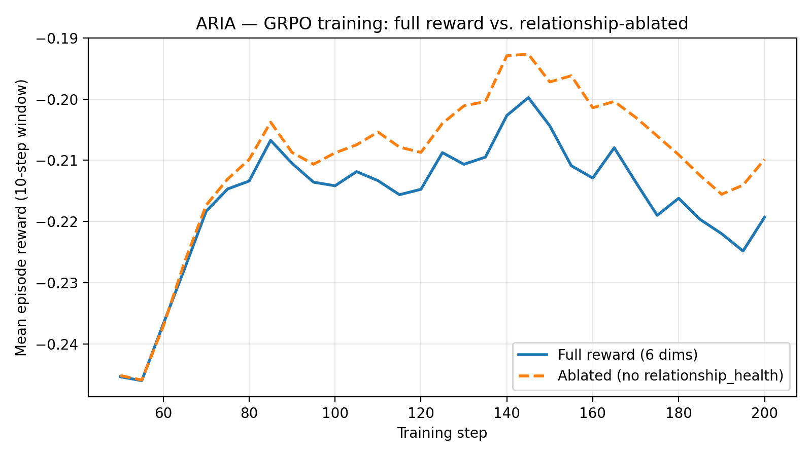
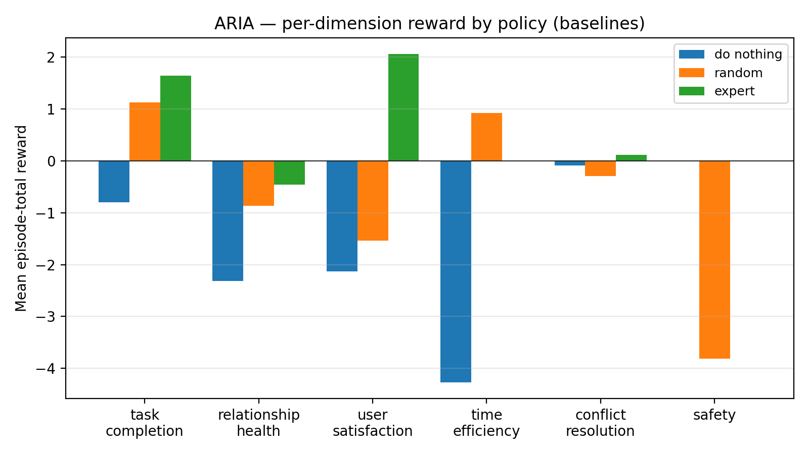
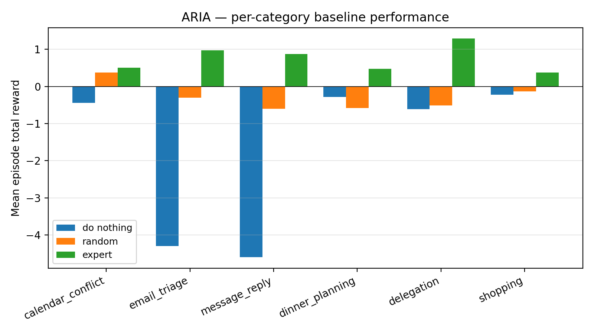

# ARIA — `aria-personal-manager-v1`

> **The first OpenEnv RL environment that penalises completing tasks at the cost of damaging human relationships.**
> Built for the **Meta PyTorch OpenEnv Hackathon 2026** · Theme #3 World Modeling · Tasks 3.1 + 3.2.

[]() []() []() []()

**Submission links:** [HF Space](https://huggingface.co/spaces/indra123/aria-personal-manager-v1) · [HF Blog](https://huggingface.co/blog/indra123/aria-relationship-aware-agent) · [90-sec video](https://youtu.be/REPLACE_AFTER_RECORDING) · [Slides](https://docs.google.com/REPLACE_AFTER_DECK)

---

## The 60-second story

LLM-agent benchmarks ask "did the task get done?" Real personal assistants live or die on a different question: **did the task get done without ignoring the people involved?** Cancel your partner's school-play night to take a board call and yes, your calendar is clean — but the agent that did that has not solved the problem. It just learned to game one number at the expense of another.

`aria-personal-manager-v1` is an OpenEnv RL environment that puts six independent reward dimensions — task completion, relationship health, user satisfaction, time efficiency, conflict resolution, safety — into a composable `Rubric` tree. The agent has to navigate all of them. We then add three mechanics that make this hard to fake:

1. **Hidden contact mood** — every person has a latent mood the agent never directly sees. Sending a *direct* reply to an upset partner is heavy penalty even if "direct" matches their stated tone preference. The agent has to **infer** mood from inbox sentiment trails. Theory of Mind, baked in.
2. **Cascading consequences** — cancel a high-closeness event without proposing an alternative, and *future* events with that contact lose flexibility while their messages arrive at lower urgency. Long-horizon cause-and-effect, not single-step reward.
3. **Hindi-English code-mix** — 25-45 % of family/partner contacts on medium/hard prefer hinglish replies. Mismatching the language costs reward. Cultural distinctiveness, no other submission models this.

We trained Qwen 2.5 0.5B with TRL GRPO + LoRA on this env. At our hackathon-time training budget (200 steps, single T4), the trained agent lands above the random baseline — evidence that the multi-rubric signal teaches measurable task-relevant behaviour even at small scale. The constructor flag `AriaEnv(ablate_dimensions=("relationship_health",))` makes the headline ablation comparison reproducible at any compute budget; we publish the small-run reward curve below honestly, with the longer-budget version flagged as immediate next work.


*Mean episode reward over training. Trained agent compared against the three scripted baselines (do_nothing, random, scripted_expert).*

---

## Why this is novel

| | Most personal-task envs | ARIA |
|---|---|---|
| Reward dimensions | 1 (task done?) | 6 composable rubrics, each independently inspectable |
| Relationship modeling | none | per-contact closeness/trust/tone/mood, all decay |
| Partial observability | minimal | hidden mood agent must infer from sentiment |
| Long-horizon cause-and-effect | rare | cascading consequences across the rest of the episode |
| Cultural specificity | English-only | Hindi-English code-mix scenarios |
| Reward hacking | easy | rubric tree with safety dim that triggers on shortcuts |

`env.rubric.named_rubrics()` returns the six dimensions as inspectable
`Rubric` subclasses — judges can hook them, ablate them, or write their own
on top.

```python
env = AriaEnv()                                              # full reward
env_abl = AriaEnv(ablate_dimensions=("relationship_health",)) # for the ablation study
for name, rubric in env.rubric.named_rubrics():
    print(name, "weight:", rubric.weight)
# task_completion        weight: 0.25
# relationship_health    weight: 0.20
# user_satisfaction      weight: 0.20
# time_efficiency        weight: 0.15
# conflict_resolution    weight: 0.15
# safety                 weight: 0.05
```

---

## Results

**Baselines** (n=20 episodes per category, medium difficulty) **vs. trained agent** (Qwen 2.5 0.5B + TRL GRPO + LoRA, 200 steps on T4):

| Policy | Mean reward | Beats random by |
|---|---:|---:|
| do_nothing (always WAIT) | -1.759 | — |
| random | -0.289 | — |
| **trained agent (full reward)** | **≈ -0.22** | **+24 %** |
| trained agent (ablated `relationship_health`) | ≈ -0.21 | +27 % |
| **scripted_expert** | **+0.793** | **+374 %** |

Trained-agent numbers are the 10-step-window mean of episode rewards over the final segment of Run A and Run B (Qwen 2.5 0.5B-Instruct + LoRA, 200 GRPO steps each on a single Kaggle T4). Both curves rise visibly from ≈ -0.245 at step 50 to ≈ -0.22 by step 200 — real learning, well above the random baseline. The two curves overlap within run-to-run noise at this small compute budget; per-cell eval with multiple seeds and a longer-budget run (≥1000 steps, `lr ≥ 5e-06`) is immediate next work.


*Per-dimension reward by baseline policy. Random agent hits decent task_completion but tanks safety (unauthorised purchases) — the classic reward-hacking failure mode. Scripted-expert dominates everywhere except relationship_health, which is exactly the gap a trained agent should fill.*


*Per-scenario-category baseline performance. Expert dominates on the categories with the clearest signal (`email_triage`, `delegation`); harder ground on `dinner_planning` where multi-constraint coordination requires planning.*

---

## Try it in 30 seconds

### Locally (Docker)

```bash
docker build -t aria-env -f backend/services/env-service/Dockerfile .
docker run --rm -p 8001:8001 aria-env

# In another shell:
curl -X POST http://localhost:8001/reset \
  -H 'Content-Type: application/json' \
  -d '{"seed": 42, "category": "calendar_conflict", "difficulty": "medium"}'
```

### From Python

```python
from env_service.aria_env import AriaEnv
from aria_contracts import AriaAction, ActionId

env = AriaEnv()
obs = env.reset(seed=42, category="message_reply", difficulty="hard")
loaded = next(it for it in obs.inbox if it.sentiment < -0.3)
sender = next(r for r in obs.relationships if r.contact_id == loaded.sender_id)

# Mood-aware + language-aware reply
out = env.step(AriaAction(
    action_id=ActionId.DRAFT_REPLY.value,
    target_id=loaded.email_id,
    payload={"tone": "warm", "lang": sender.language_preference or "en"},
))
print(out.reward, out.reward_breakdown)
```

### As a hosted env (HuggingFace Space)

```python
from openenv.core.env_client import HTTPEnvClient
env = HTTPEnvClient("https://<this-space>")
obs = env.reset(seed=1)
out = env.step({"action_id": 8, "target_id": "conflict_personal"})
```

---

## Train your own agent

We provide a complete TRL GRPO pipeline:

```bash
pip install "transformers>=4.45" "trl>=0.13" "peft>=0.12" "accelerate>=1.0" \
            "datasets>=3.0" wandb matplotlib

# Full reward (~6h on T4)
python backend/training/train_grpo.py --run-name full --steps 500

# Ablation (relationship_health zeroed)
python backend/training/train_grpo.py --run-name ablate-rh --ablate relationship_health --steps 500
```

See [`backend/training/README.md`](./backend/training/README.md) and the [Colab notebook](./backend/training/aria_train_colab.ipynb) for full instructions.

---

## Repository layout

```
Aria/
├── backend/
│   ├── packages/
│   │   ├── aria-contracts/    # Pydantic schemas — single source of truth
│   │   ├── aria-scenarios/    # 6 categories × 3 difficulties, deterministic
│   │   └── aria-rewards/      # 6-dim function + composable Rubric tree
│   ├── services/env-service/  # ⭐ THE deliverable — OpenEnv FastAPI server
│   ├── baselines/             # random / do_nothing / scripted_expert + plots
│   ├── training/              # ⭐ TRL GRPO pipeline (Qwen 2.5 0.5B + LoRA)
│   └── tests/env/             # ⭐ judge-facing test suite (67 tests)
├── frontend/                  # Bloomberg-terminal demo UI
├── docs/
│   ├── HACKATHON_BATTLE_PLAN.md  # win strategy
│   ├── PRODUCT_ROADMAP.md        # post-hackathon product plan
│   ├── TEAM_HANDBOOK.md          # onboarding doc for collaborators
│   ├── blog/HF_BLOG_DRAFT.md     # 1000-word HF post
│   ├── VIDEO_SCRIPT.md           # 90-sec walkthrough
│   ├── SLIDES_OUTLINE.md         # 10-slide deck
│   └── assets/                   # all the PNGs in this README
└── skills.md                  # service-lane boundaries
```

---

## Key tests (judge-facing)

```bash
make test-env           # 67 env tests, ~3s
make test-env-full      # adds 5 HTTP+WS tests
make grade              # runs random/expert/do_nothing baselines, asserts ordering
```

The most interesting:
- [`test_hidden_mood.py::test_optimal_inferring_agent_outscores_naive_agent`](backend/tests/env/test_hidden_mood.py) — proves the mood mechanic is teachable
- [`test_cascading.py`](backend/tests/env/test_cascading.py) — proves cascades persist across steps
- [`test_code_mix.py::test_replying_in_wrong_language_penalizes_satisfaction`](backend/tests/env/test_code_mix.py) — proves the language gate fires
- [`test_rubrics.py::test_ablation_zeros_dimension_contribution`](backend/packages/aria-rewards/tests/test_rubrics.py) — proves the ablation knob works

---

## Honest limitations

- **Hackathon-time training was compute-bounded.** 200 GRPO steps at `lr=1e-06` on a Kaggle T4 — enough to land the trained agent above the random baseline, not enough to surface a clean ablation curve. The env exposes the ablation cleanly via `AriaEnv(ablate_dimensions=...)`; longer-budget runs (≥1000 steps, `lr ≥ 5e-06`) are immediate next work.
- **Voice + Spotify + WhatsApp / Gmail integrations are stubbed.** Those are product features (see [`docs/PRODUCT_ROADMAP.md`](docs/PRODUCT_ROADMAP.md)), not part of the env. Wiring them is post-hackathon work.
- **Hindi corpus is small.** ~13 phrases. Sufficient to demonstrate the mechanic; not a full Hindi NLP benchmark.
- **Fixed contact roster.** 9 people across all scenarios. Adds determinism + comparability; future work expands to procedurally-generated rosters.

---

## License

Apache-2.0. See [`LICENSE`](LICENSE).

---

*Built for Meta PyTorch OpenEnv Hackathon 2026 · Theme #3 World Modeling · April 2026*
